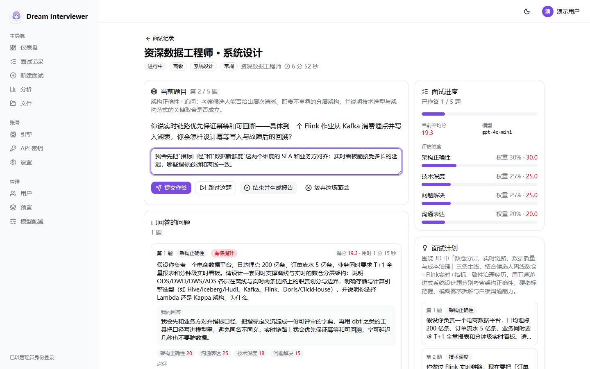
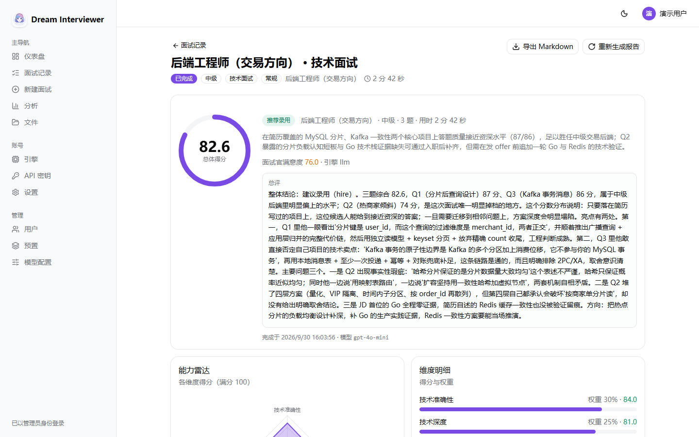
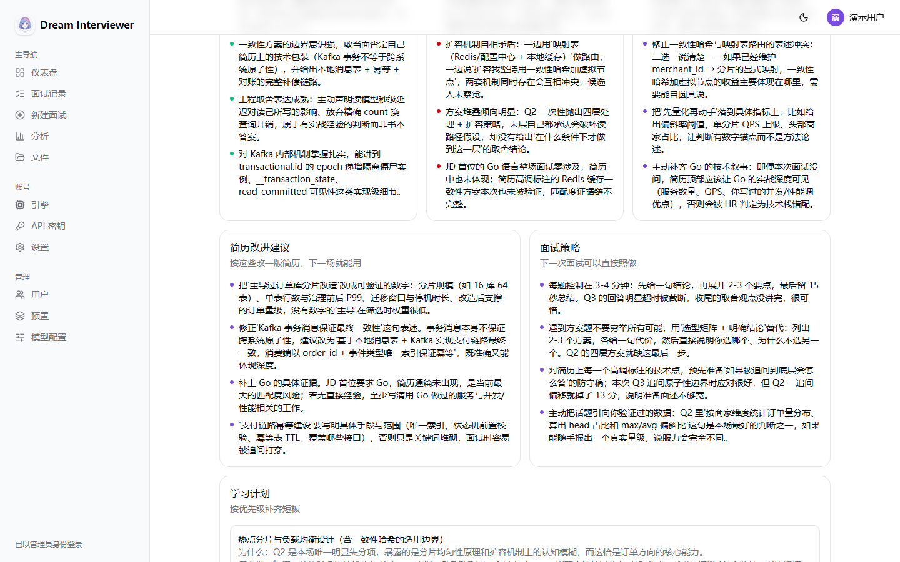
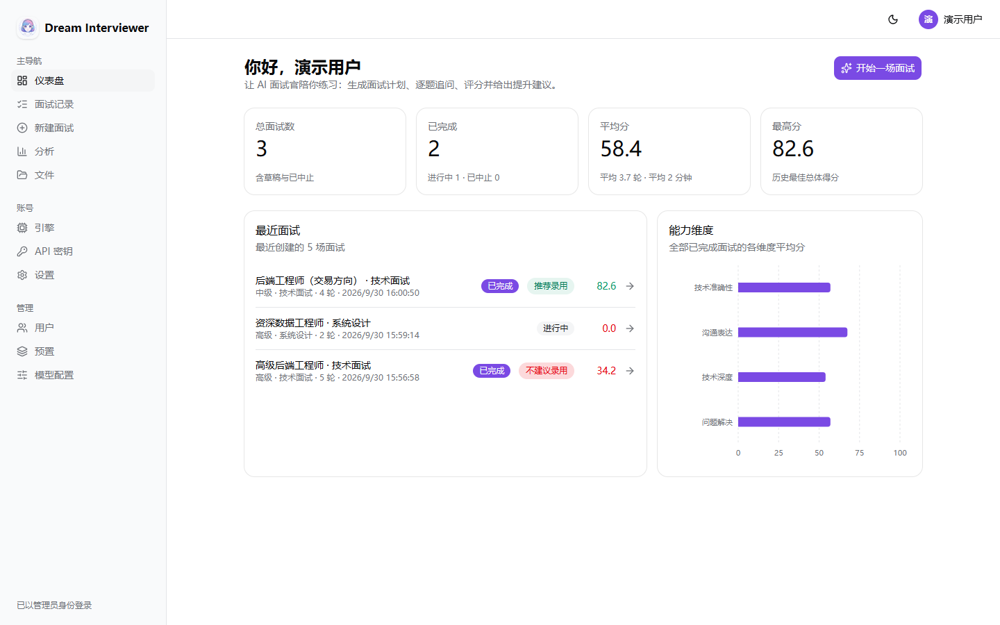
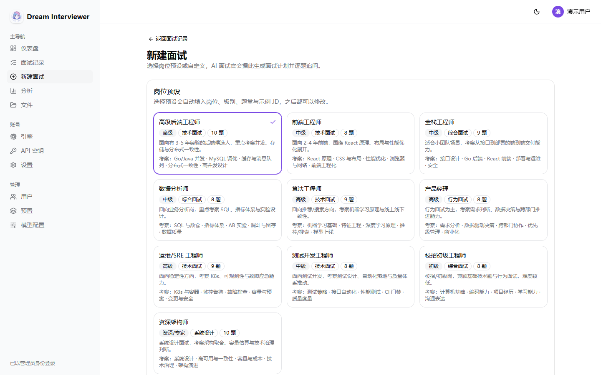
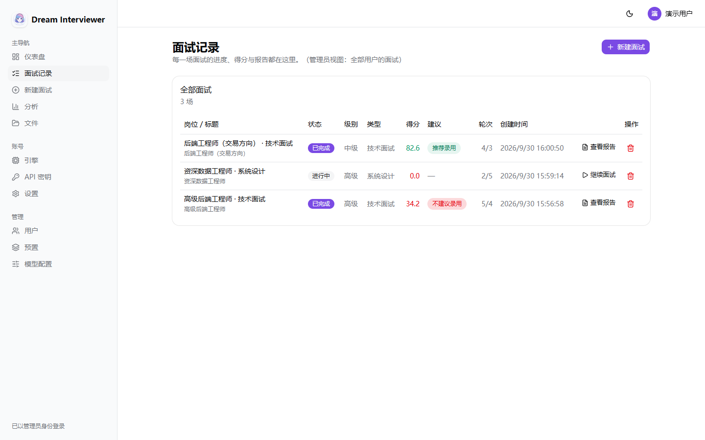
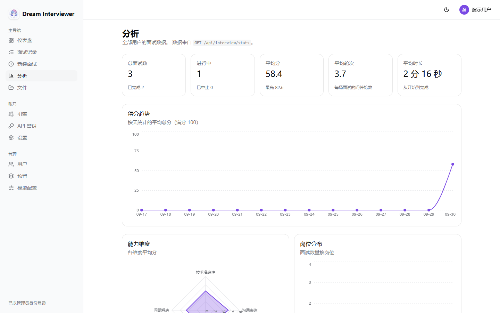
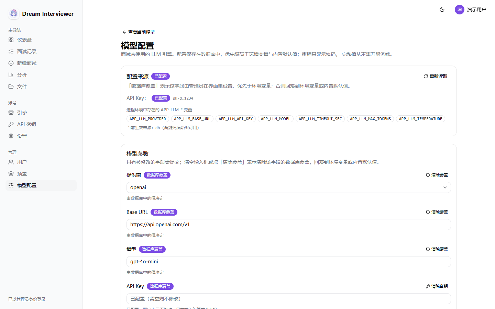
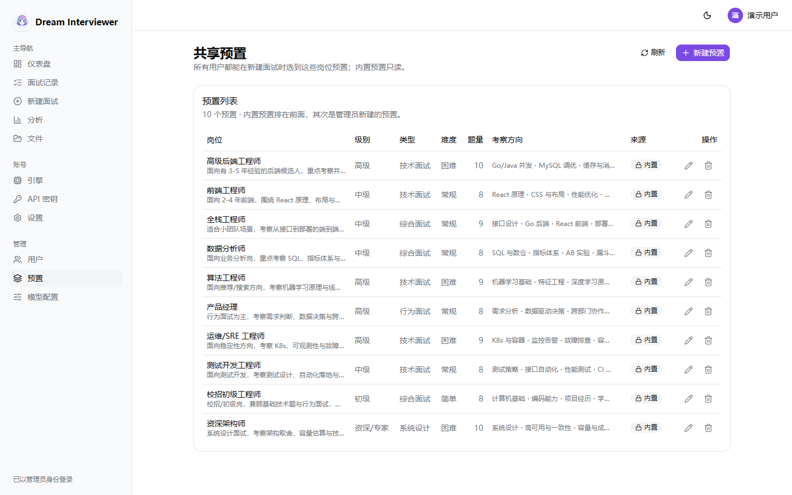

# Dream Interviewer · AI 模拟面试官

一个可以自己部署的 AI 面试官：填写目标岗位与简历，它会**出题 → 一问一答 → 逐题打分 → 追问 → 出评估报告**。

**这个仓库原本是一个 2024 年的 Coze / Spring Boot 小项目**（`Dream-Interviewer-backend/` + `Dream-Interviewer-frontend/`），只做"简历 + JD 进 → 聊天框里输出一段评价文字"。**v1.0.0 是对它的完全重写**：产品内核保留——一次一道题的引导式面试、多维度百分比评分、简历改进建议、预测 HR 满意度——但代码是全新的（Go + Next.js 编译成一个二进制，带真实的状态机、可查询的历史与流式交互）。旧版本完整保留在 tag [`legacy-2024`](https://github.com/Potterluo/Dream-Interviewer/releases/tag/legacy-2024)；旧代码没有被复用，因此本项目的 MIT 许可只覆盖新代码。

```
Go 1.25 · net/http stdlib 路由 · SQLite（纯 Go 驱动）/ PostgreSQL
Next.js 16 · React 19 · Tailwind v4 · shadcn 风格组件（Base UI）
一个二进制文件：前端静态导出后用 go:embed 内嵌，同源、无 CORS、无需外部数据库
```



> 面试房间：左侧是当前题目与作答区，右侧实时显示进度、当前平均分与各维度得分，下方是已答题目和逐题点评。
> 截图里的面试是真实跑出来的——包括报告里的点评内容。

---

## 一分钟跑起来

需要 Go 1.25+、Node 22+、pnpm 10。Windows 上没有 `make`，用下面的等价命令：

```powershell
# 1. 构建前端静态导出
cd web; pnpm install; $env:MARKDOWN_FULL="1"; pnpm build; cd ..

# 2. 把导出结果放进 go:embed 目录（必须整体替换，不能覆盖合并）
Remove-Item -Recurse -Force internal\server\dist
Copy-Item -Recurse web\out internal\server\dist

# 3. 编译单文件二进制
go build -ldflags "-s -w" -o bin/app.exe ./cmd/server

# 4. 运行
.\bin\app.exe                      # http://localhost:8080
```

第一次访问会跳到 `/onboard` 创建管理员账号，之后就能用了。数据在 `./data/app.db`（SQLite，WAL 模式）。健康检查：`/healthz`、`/livez`、`/readyz`。

> Linux / macOS 上有 `make`，`make build` 一步完成上面全部三步。

---

## 面试官模型用的是什么？

**源码里不含任何密钥，也不含任何私有地址。** 这是一个刻意的设计：凭证属于部署，不属于代码仓库。模型配置有两个来源，按字段合并，**数据库优先**：

```
① 界面配置（管理员在 /admin/model/ 里填，存数据库）   ← 最高优先级
② 环境变量 / .env（适合容器化、无界面部署）
③ 内置默认值（只有数值型有：timeoutSec=90、maxTokens=8192、temperature=0.4）
```

所以首次启动时**模型是未配置状态**，面试会自动走内置题库与评分规则（见下文），并且在界面上说明原因。配好之后立即生效，不用重启。

### 两种配置方式

**方式一：在界面里配（推荐，需要管理员）**

访问 `/admin/model/`，填 provider / baseUrl / model / API key / 超时 / 预算 / 温度，点「测试连接」先验证再保存。页面上每个字段都会标明当前值来自哪里（数据库覆盖 / 环境变量 / 内置默认），所以"为什么用的是这个模型"不用去翻部署配置。

**方式二：用 `.env`（适合镜像/容器）**

```powershell
Copy-Item .env.example .env      # .env 已在 .gitignore 里，不会被提交
# 编辑 .env，填入你的 baseUrl / apiKey / model
.\bin\app.exe
```

| 变量 | 默认值 | 说明 |
|---|---|---|
| `APP_LLM_PROVIDER` | `custom` | `custom` / `siliconflow` / `openai`，只决定下面两项的默认值 |
| `APP_LLM_BASE_URL` | *按 provider* | 例如 `https://api.siliconflow.cn/v1` |
| `APP_LLM_API_KEY` | *(无)* | Bearer token；**没有任何内置默认值** |
| `APP_LLM_MODEL` | *按 provider* | 例如 `Qwen/Qwen2.5-7B-Instruct` |
| `APP_LLM_TIMEOUT_SEC` | `90` | 单次调用预算 |
| `APP_LLM_MAX_TOKENS` | `8192` | **推理型模型的思考过程也占这个预算**，见下 |
| `APP_LLM_TEMPERATURE` | `0.4` | 采样温度 |

只要接口是 OpenAI 兼容的（SiliconFlow、DeepSeek 官方、OpenAI、vLLM、Ollama、LiteLLM……）都能用，**不用改代码**。

`.env` 的查找顺序是「当前工作目录 → 二进制同目录」，**真实环境变量永远优先于 `.env`**（这样容器可以覆盖镜像里烤进去的文件）。启动后 `App_LLM_API_KEY` 会被从进程环境里擦除（`config.ScrubBootSecrets`），不会泄漏给子进程。

### 换到 SiliconFlow 的例子

```powershell
$env:APP_LLM_PROVIDER = "siliconflow"
$env:APP_LLM_API_KEY  = "sk-..."          # 你账号里的 key
$env:APP_LLM_MODEL    = "XingChenAGI/Xing4.0-29B"
.\bin\app.exe
```

> **注意**：开发时提供的那个 SiliconFlow key实测**余额不足**——对包括"免费"模型在内的所有模型都返回
> `HTTP 402 {"code":30001,"message":"Sorry, your account balance is insufficient"}`。
> 所以本机的 `.env` 里配的是另一套可用网关（也已注释掉 SiliconFlow 那几行）。要换 SiliconFlow，请先在 `/admin/model/` 点「测试连接」确认该 key 可用。

### 关于 `max_tokens` 和推理型模型

像 `deepseek-r1`、`o3-mini` 这类**推理型模型**会先输出一段 `reasoning_content`（思考），再输出 `content`（正文），而**思考同样计入 `max_tokens`**。预算太小时，模型会把预算全花在思考上并返回空正文（`finish_reason: "length"`）。

代码对此做了两层处理：

1. 默认预算给到 8192（而不是常见示例里的 1024/2048）；
2. 检测到"预算耗尽且正文为空"时，在**还没有向用户输出任何内容**的前提下自动把预算翻倍重试一次（上限 32768）；一旦已经输出过内容就绝不重放，避免让候选人看到两遍前缀。

`reasoning_content` 永远**不会**流给候选人——把模型的内心独白展示给面试者是 bug，不是 feature。

### 没有可用模型时也不会白屏

任何一次模型调用失败（没配 key、超时、余额不足、返回格式错误），面试都会**自动降级到内置题库与内置评分规则**，而不是报错终止。降级时会在同一条流里明确告诉用户：

> ⚠️ **已切换为内置题库与评分规则**，本次结果不是模型生成的。原因：……

内置引擎是确定性的（99 道人工整理的题库 + 10 套内置预设），评分基于五个可观测信号：关键词覆盖率、表达结构、技术细节、因果推理、实战佐证。**它不含语义理解**，报告里会写明这一点。它的作用有三个：零配置也能演示完整产品；后端逻辑有完全不依赖网络的单元测试；模型中途挂掉时面试能继续。

---

## 功能

| 模块 | 说明 |
|---|---|
| 新建面试 | 岗位预设一键填充、级别 / 类型 / 难度 / 语言、题量 3–15、JD 与简历文本 |
| 题目大纲 | 模型按**你的简历和 JD**出题（不是通用八股），每题带考察点、权重、参考答案要点、追问方向 |
| 面试进行 | 一问一答；作答后**流式**返回点评与逐维度分数；达标的回答会触发自适应追问（每题最多 1 次、每场最多 3 次）；可跳过、可提前结束、也可放弃整场 |
| 评估报告 | 综合分、预测 HR 满意度、四维雷达、逐题点评、优势 / 短板、改进建议、**简历改进建议**、**面试策略**、学习计划、高光原话、风险提示、录用建议 |
| 面试记录 | 列表带状态与录用建议徽章、继续未完成的面试、查看报告、删除；实时刷新 |
| 统计分析 | 得分趋势、能力维度均值、岗位分布、录用建议分布、完成率 |
| 引擎面板 | 当前 provider / baseUrl / 模型 / 掩码后的 key / 配置来源 + 一键测试连接（含延迟） |
| Markdown 导出 | 整场面试 + 报告导出为 `.md` |

### 评分模型

面试类型决定评分维度（权重和为 1）：

- **技术面试**：技术准确性 0.30 · 技术深度 0.25 · 问题解决 0.25 · 沟通表达 0.20
- **系统设计**：架构正确性 0.30 · 技术深度 0.25 · 问题解决 0.25 · 沟通表达 0.20
- **行为面试**：情境应对 0.30 · 团队协作 0.25 · 自我认知 0.20 · 沟通表达 0.25
- **综合面试**：专业能力 0.30 · 逻辑思维 0.25 · 沟通表达 0.25 · 岗位匹配 0.20

沿用原项目的口径：**单项得分 = 候选人展现的能力 ÷ 该级别期望的能力 × 100**；总分是各维度按权重加权平均；录用建议按总分分档（≥85 强烈推荐 / ≥72 推荐 / ≥58 待定 / 其余不推荐）。报告里的"预测 HR 满意度"是独立的数字——它衡量简历与表达给 HR 的第一印象，和技术得分不必一致。

---

## 界面

下面这些截图都是**真实跑出来的**（真模型、真数据），不是示意图。

### 评估报告

报告是最能体现这个项目的地方：除了分数，它会指出具体哪一句回答不严谨、哪个能力项没有被采样到。





### 其余页面

| | |
|---|---|
| **仪表盘** —— 总览统计、最近面试、能力维度均值<br> | **新建面试** —— 10 套内置岗位预设，可改写岗位 / 级别 / 难度 / 题量 / JD / 简历<br> |
| **面试记录** —— 状态、得分、录用建议、继续未完成的面试<br> | **统计分析** —— 得分趋势、能力维度、岗位分布<br> |
| **模型配置**（管理员）—— 每个字段标明当前值来自数据库 / 环境变量 / 内置默认，可先「测试连接」再保存<br> | **共享预置**（管理员）—— 内置预置只读，管理员可增删改自己创建的<br> |

---

## 页面与权限

| 路由 | 内容 | 谁能看 |
|---|---|---|
| `/` | 仪表盘：开始面试入口、总览统计卡、最近面试、能力维度条 | 已登录 |
| `/interviews/` | 面试记录表（带 `?userId=` 时是管理员的"查看某人记录"视图） | 已登录（只看到自己的） |
| `/interviews/new/` | 新建面试向导 | 已登录 |
| `/interview/?id=…` | 面试房间（草稿 → 进行中 → 报告，三态由 `status` 驱动） | 本人 |
| `/analytics/` | 统计分析 | 已登录（只统计自己的） |
| `/settings/engine/` | 当前面试官模型（只读）+ 管理员入口 | 已登录 |
| `/admin/model/` | 配置面试官模型、测试连接、清除覆盖 | **管理员** |
| `/admin/presets/` | 共享岗位预设的增删改 | **管理员** |
| `/admin/users/` | 用户管理 + 每个用户的面试统计 + 跳转查看其记录 | **管理员** |
| `/files/` · `/settings/` · `/settings/apikeys/` · `/onboard/` | 文件、账号、API key、首次运行 | 已登录 / 首次运行 |

**权限模型**（服务端是唯一权威，前端隐藏只是体验）：

| | 普通用户 | 管理员 |
|---|---|---|
| 面试记录与评估 | 只能看自己的 | 可以看所有人的（`?all=true` / `?userId=`） |
| 岗位预设 | 可以选用全部 | 可以创建 / 修改 / 删除自己的；内置的只读 |
| 面试官模型 | 只能看到用的是哪个模型 | 可以配置、测试、清除；能额外看到端点与密钥掩码 |
| 用户管理 | — | 增删改、重置密码、查看每人的统计 |

别人的单条记录永远返回 **404**（不暴露存在性，避免猜 id）；而 `?all=` / `?userId=` 这类**放宽范围**的参数，普通用户调用会得到明确的 **403**，不是被静默过滤成空列表——权限试探应该在日志里留痕，而不是看起来像"没有数据"。

内置预设（`builtin: true`）是编译进二进制的产品内容，**不可修改也不可删除**（返回 409），避免误操作把精选集合改坏；管理员自建的预存在数据库里，对所有用户可见。

### 权限与凭证的几条保证

- **降级管理员会立即失效**，包括他名下的 API key。`IsAdmin()` 同时要求「账号当前角色是 admin」与「这个 key 本身是 admin 级」，两者缺一不可——否则一个被降级的人可以拿旧 key 继续读所有人的面试记录并把自己改回管理员。同理，管理员签发的 user 级 key 只会**收窄**权限，永远不会**放大**。
- **密钥从不出现在任何响应里**，只返回掩码（`0ef0…f483`）与"是否已配置"。启动日志也只写 `api_key_set=true`。
- **普通用户看不到模型端点**，只能看到模型名——"知道是谁在面试你"与"知道公司的私有网关地址"是两件事。
- **API key 存库时是明文的**（管理员在界面填的那一份）。如果你需要磁盘级加密，用 `.env` + 部署平台 secret，不要用界面保存 key。
- `.env` 同时在 `.gitignore` 与 **`.dockerignore`** 里：Dockerfile 会 `COPY . .`，只忽略 git 是不够的。

> 详情页用查询参数（`/interview/?id=…`）而不是 `[id]` 动态路由：前端是 `output: "export"` 纯静态导出，动态段需要 `generateStaticParams`，查询参数更简单也更稳。

---

## API

完整契约见 [`docs/API.md`](docs/API.md)（字段、枚举、SSE 帧协议、状态码都在里面）。要理解的最重要一点：**整场面试由一个流式端点驱动**。

```
GET/POST       /api/interviews               列表 / 新建
GET/PUT/DELETE /api/interviews/{id}          详情 / 改配置（仅草稿）/ 删除
POST           /api/interviews/{id}/advance  ← 唯一的推进端点，SSE
GET            /api/interviews/{id}/export   Markdown 导出
GET            /api/interview/stats          统计聚合
GET            /api/interview/presets        岗位预设 + 枚举文案
GET            /api/interview/engine         当前模型（只读，key 已掩码）

GET            /api/admin/settings           模型配置（管理员）
PUT/DELETE     /api/admin/settings           保存 / 清除覆盖
POST           /api/admin/settings/test      连通性自检（可用表单值先测后存）
POST           /api/admin/presets            共享预设增删改（管理员）
PUT/DELETE     /api/admin/presets/{id}
GET            /api/admin/users/{id}/overview 某用户的面试统计
```

`POST /api/interviews/{id}/advance` 的 body 是 `{"action":"start|answer|skip|finish|abort","answer":"…","elapsedSec":95,"turnId":"tr_…"}`，返回 `text/event-stream`，帧类型：`stage` / `delta` / `plan` / `grade` / `question` / `report` / `done` / `error`。所有路径都以恰好一个 `done` 或一个 `error` 收尾。

为什么是一个端点而不是 ask / answer / grade / report 四个：状态机只能有一处定义，否则客户端就能把面试推进到服务端没打算让它进入的状态。终帧 `done` 携带权威状态，客户端丢掉本地累积值直接采信即可。

所有 JSON 响应都是同一个信封：`{"ok": true, ...}` 或 `{"ok": false, "error": "..."}`。

---

## 配置

**环境变量 + `.env`，没有配置文件**；模型相关字段还可以在界面上由管理员覆盖（数据库优先，见上文）。`.env` 从「当前工作目录 → 二进制同目录」查找，真实环境变量永远优先。

| 变量 | 默认 | 含义 |
|---|---|---|
| `APP_PORT` | `8080` | HTTP 端口 |
| `APP_BIND` | `loopback` | `loopback` 或 `all`（0.0.0.0） |
| `APP_DATA_DIR` | `./data` | 数据目录（SQLite 与上传文件） |
| `APP_DB_TYPE` | `sqlite` | `sqlite` 或 `postgres` |
| `APP_DB_DSN` | *(sqlite 文件)* | postgres DSN，或显式 sqlite 路径 |
| `APP_DB_AUTO_MIGRATE` | `true` | 启动时执行迁移 |
| `APP_COOKIE_SECURE` | `false` | 上 HTTPS 后设为 `true` |
| `APP_RATE_LIMIT_RPM` | `0`（关） | 每用户每分钟 `/api/*` 请求上限 |
| `APP_DEV_PROXY` | *(关)* | 开发时把 UI 反代到 `http://localhost:3000` |
| `APP_LOG_LEVEL` | `info` | `debug` / `info` / `warn` / `error` |
| `APP_LLM_*` | 见上表 | 面试官模型（**无内置密钥**） |

命令行参数会覆盖环境变量：`./bin/app.exe -port 9000 -data-dir /var/lib/app -version`。

---

## 架构

```
cmd/server/            入口（-port -data-dir -dev-proxy -version）
cmd/desktop/           Wails 桌面壳，复用同一个 server.BuildHandler
cmd/generator/         模板自带的脚手架（init / entity）
internal/config/       env + .env 启动配置（不含任何凭证）
internal/llm/          OpenAI 兼容客户端（Chat / ChatStream / ChatJSON）
internal/interview/    产品大脑：领域类型、prompt、评分维度、内置题库与规则引擎
internal/store/        Store 接口 + sqlite/postgres 双驱动 + 分层迁移
internal/auth/         会话 cookie、API key、bcrypt、角色与权限门
internal/events/       进程内 pub/sub（SSE 扇出）
internal/server/       HTTP 层，一个领域一个文件；server.go 是路由表
                       settings.go 解析模型配置并承载管理员接口
                       scope.go 决定一次列表/聚合能看到谁的数据
internal/server/dist/  go:embed 的构建产物（不要手改，由构建步骤生成）
web/src/app/           Next.js 页面（全部客户端组件 + 静态导出）
web/src/lib/api.ts     统一的 fetch 封装（信封、cookie/bearer、actAs 透传）
web/src/lib/api/       按领域拆分的类型化客户端
web/src/components/ui/ shadcn 风格基础组件（Base UI，不是 Radix）
scripts/smoke.ps1      79 项断言的端到端冒烟测试
docs/API.md            冻结的 API 契约
```

**面试领域的组织方式**：`interviews` 一行表示一场面试（配置 + 生命周期 + 模型产物），`interview_turns` 一行表示一次提问。模型产物（`plan_json`、`grade_json`、`report_json`）以 JSON 文本存在列里，因为它们的形状由 prompt 迭代决定；而**需要查询或聚合的字段**（`status`、`overall_score`、`recommendation`、`role`、耗时）都是真实列。结果是统计页从不解析 JSON，改 prompt 也从不需要迁移。

---

## 开发

```powershell
# 终端 1：前端热重载
cd web; pnpm dev

# 终端 2：Go 服务，UI 反代到 :3000
$env:APP_DEV_PROXY="http://localhost:3000"; go run ./cmd/server
```

打开 http://localhost:8080 —— API 同源打到 Go，UI 改动热重载。

```powershell
# 质量门禁
go build ./... ; go vet ./... ; go test ./...
cd web ; pnpm lint ; pnpm build

# 端到端冒烟测试（会真的调用模型，约 1-2 分钟）
pwsh -NoProfile -File scripts/smoke.ps1
```

`scripts/smoke.ps1` 会自己起一个临时服务，走完 onboard → 模型状态与自检 → 预设 → 新建 → 开始 → 作答 → 跳过 → 出报告 → 回读 → 导出 → 统计 → SSE → 边界校验 → 建用户/删用户 → 超短回答 → 放弃面试 → 级联删除 → **RBAC（普通用户越权全部被拒）** → **降级管理员后其 API key 也必须立即失效** → **管理员模型配置（含数值覆盖用 `""` 清除）** → **共享预设增删改（内置的只读）**，共 219 项断言，结束后清理临时数据。参数：`-Port`、`-DataDir`、`-KeepData`、`-ShowFrames`。

> 冒烟测试依赖一个可用的模型。它从 `.env`（或环境变量）读取，所以请先按上文配好；如果模型不可用，面试会走内置引擎，测试仍然会通过降级路径。

### 桌面版（Wails）

```powershell
# 需要先完成 web → internal\server\dist 的拷贝
go build -tags desktop,production -ldflags "-s -w -H windowsgui" -o bin/app-desktop.exe ./cmd/desktop
```

桌面壳在临时回环端口上跑同一个 HTTP handler，窗口指向它。**流式响应必须走真实 TCP**——WebView2 会缓冲自定义协议响应，所以不要把它改回 asset server 方案。

---

## 已知边界

- **面试官模型是外部依赖**。没有可用模型时产品仍然完整可用，但结论来自确定性规则而非语义理解，报告里会写明。
- **首次启动需要配一次模型**（`/admin/model/` 或 `.env`），因为源码里不含任何凭证。没配也能跑，只是走内置引擎。
- **速度**：整场面试（3 题）约 1–2 分钟，瓶颈是模型；每一步都有流式输出，所以不是"转圈等到结束"。
- **没有语音**。原项目也没有。要接 TTS/ASR，挂在 `/interview/` 页面的作答区后面即可，后端状态机不用动。
- **超短回答不调用模型**。少于 4 个字的作答（如 `a`、`嗯`）直接由内置规则判 0 分并如实说明——让模型评价一段没有内容的回答，它一定会编出一段与题目无关的点评。
- **重复提交不会重复评分**。同一场面试的推进是串行的（并发重复直接 409），作答写入是 `answered_at IS NULL` 的比较交换，并且提交可以带 `turnId` 绑定到具体哪道题：迟到的重试会被拒绝，不会被算到下一题上。
- **简历是纯文本粘贴**。模板自带 `/files/` 上传接口，但没有做 PDF/DOCX 文本抽取（原项目把这件事外包给了 Moonshot 的 Files API）。
- **API key 存在数据库里是明文**（管理员在界面上填的那一份）。它从不出现在任何 API 响应里（只返回掩码），启动后也会从进程环境里擦除；但如果你需要磁盘级加密，请用 `.env` + 部署平台 secret，不要用界面保存 key。
- **内置预置不可编辑**（返回 409），管理员只能增删改自己创建的预设。这是刻意的：精选集合是产品内容，不该被一次误操作改坏。

## License

MIT — 见 [LICENSE](LICENSE)。本仓库 2024 年的旧版本（Apache-2.0）完整保留在 tag [`legacy-2024`](https://github.com/Potterluo/Dream-Interviewer/releases/tag/legacy-2024)。
